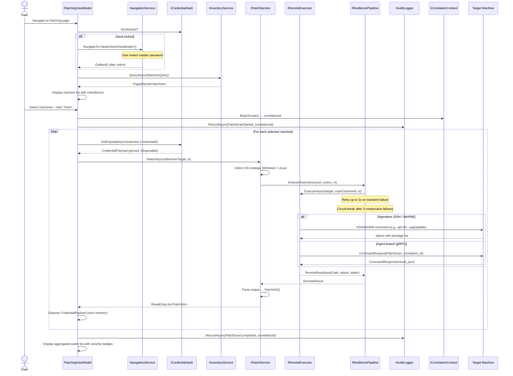
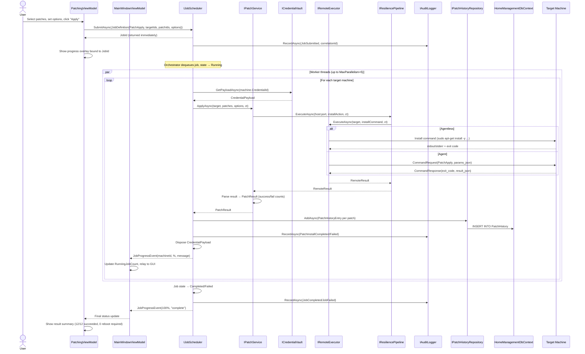
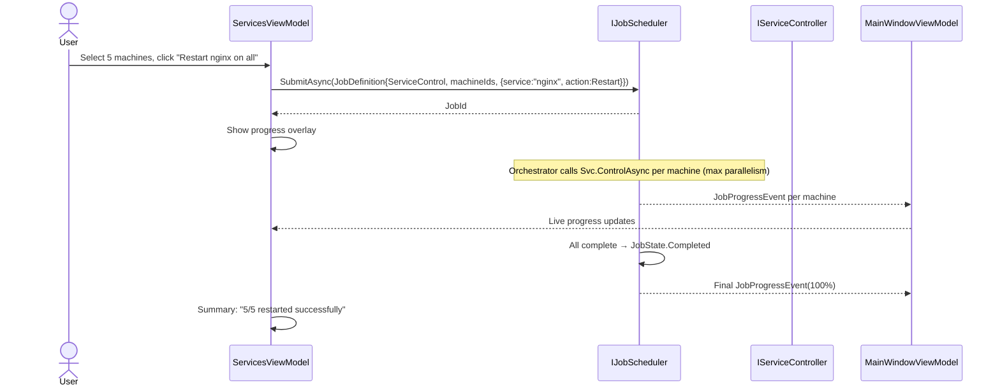
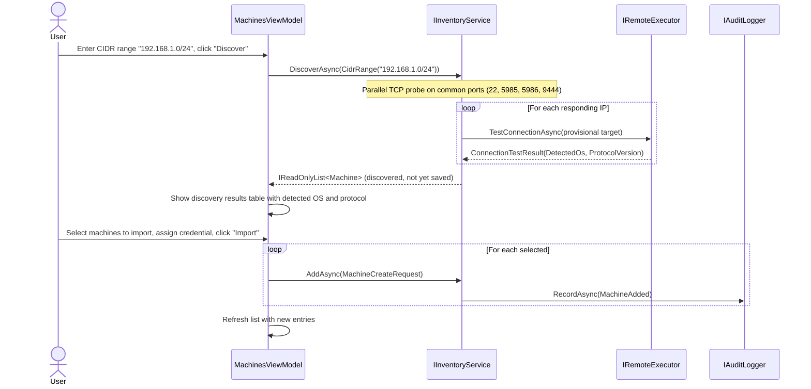
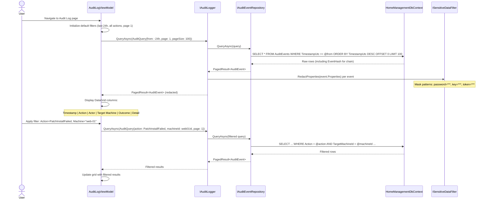
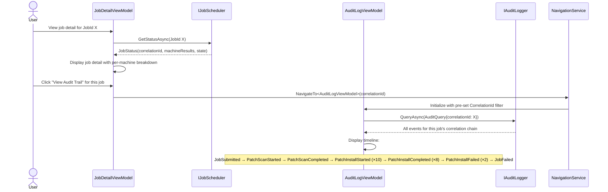
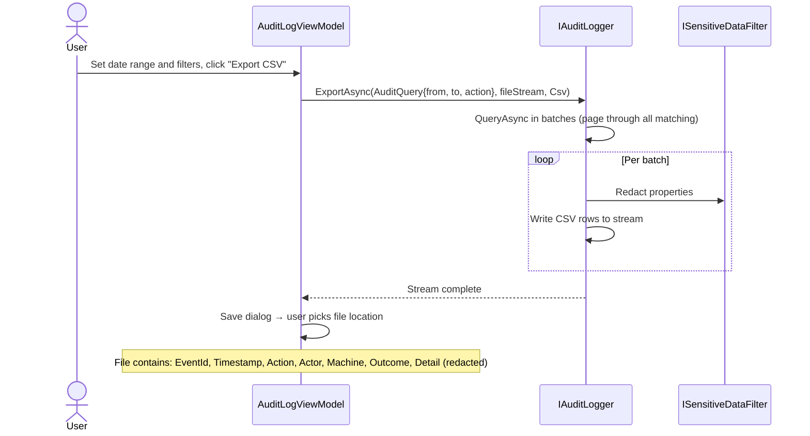
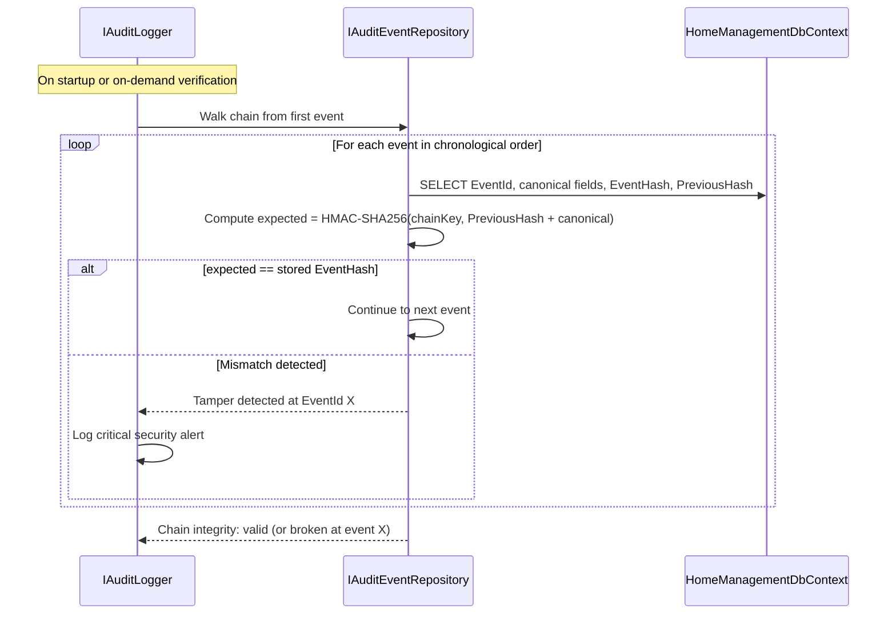
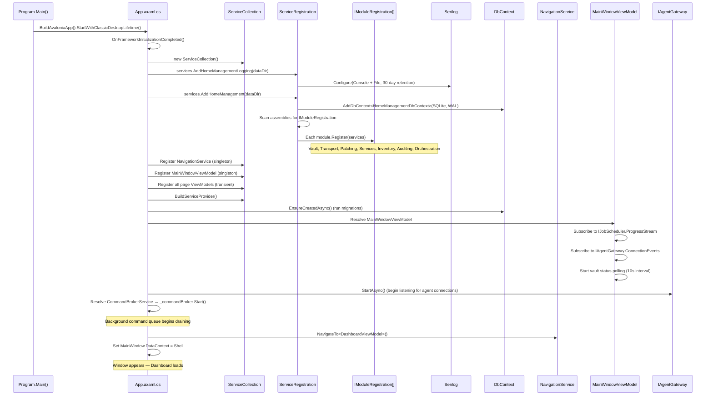

# 13 — Integration Architecture

> How the GUI, backend modules, credential vault, remote execution engine, patch manager, and service controller interact end-to-end.
>
> **Revision 2 — 2026-03-21:** Control-plane ownership clarified.
> Broker is the control-plane core. AgentGateway is an agent transport boundary, not a second orchestration engine.
> **Revision 3 — 2026-03-21:** Authentication boundary clarified.
> Auth.Host is the system-of-record issuer for platform authentication. Local auth is the required provider for the corrected baseline.

---

## 1. Component Map

```
┌────────────────────────────────────────────────────────────────────────────────┐
│                         Avalonia GUI (Desktop App)                             │
│  ┌─────────────┐ ┌────────────┐ ┌─────────────┐ ┌────────────┐ ┌───────────┐ │
│  │ Dashboard   │ │ Machines   │ │ Patching    │ │ Services   │ │ Jobs      │ │
│  │ ViewModel   │ │ ViewModel  │ │ ViewModel   │ │ ViewModel  │ │ ViewModel │ │
│  └──────┬──────┘ └─────┬──────┘ └──────┬──────┘ └─────┬──────┘ └─────┬─────┘ │
│         │              │               │               │              │        │
│  ┌──────┴──────────────┴───────────────┴───────────────┴──────────────┴──────┐ │
│  │                    MainWindowViewModel (Shell)                            │ │
│  │  Owns: NavigationService · Status Bar · Reactive Subscriptions           │ │
│  └──────────────────────────────┬───────────────────────────────────────────┘ │
└──────────────────────────────────┼────────────────────────────────────────────┘
                                   │  DI-injected interfaces only
═══════════════════════════════════╪═══════════════════════════════════════════════
              Public API Surface   │   (HomeManagement.Abstractions)
═══════════════════════════════════╪═══════════════════════════════════════════════
    ┌──────────────────────────────┼──────────────────────────────────────┐
    │                              │                                      │
    │  ┌──────────────┐ ┌─────────┴──────┐ ┌───────────────┐            │
    │  │ ICredential  │ │ IJobScheduler  │ │ IAuditLogger  │            │
    │  │ Vault        │ │ (Orchestrator) │ │               │            │
    │  └──────┬───────┘ └────────┬───────┘ └───────┬───────┘            │
    │         │                  │                  │                    │
    │  ┌──────┴───────┐ ┌───────┴────────┐ ┌──────┴───────┐            │
    │  │ IInventory   │ │ IPatchService  │ │ IService     │            │
    │  │ Service      │ │               │ │ Controller   │            │
    │  └──────┬───────┘ └───────┬────────┘ └──────┬───────┘            │
    │         │                 │                  │                    │
    │         └────────┬────────┴─────────┬────────┘                    │
    │                  │                  │                              │
    │           ┌──────┴───────┐  ┌───────┴────────┐                    │
    │           │ IRemote      │  │ IResilience    │                    │
    │           │ Executor     │  │ Pipeline       │                    │
    │           └──────┬───────┘  └───────┬────────┘                    │
    │                  │                  │                              │
    └──────────────────┼──────────────────┼──────────────────────────────┘
                       │                  │
═══════════════════════╪══════════════════╪════════════════════════════════
       Transport Layer │                  │   Cross-Cutting
═══════════════════════╪══════════════════╪════════════════════════════════
    ┌──────────────────┼──────────────────┼──────────────────┐
    │                  │                  │                  │
    │  ┌───────┐  ┌────┴───┐  ┌────────┐ │  ┌─────────────┐│
    │  │ SSH   │  │ WinRM  │  │ PS     │ │  │ ICorrelation││
    │  │ .NET  │  │ HTTPS  │  │ Remote │ │  │ Context     ││
    │  └───┬───┘  └───┬────┘  └───┬────┘ │  └─────────────┘│
    │      │          │           │      │  ┌─────────────┐│
    │  ┌───┴──────────┴───────────┴───┐  │  │ ISensitive  ││
    │  │ gRPC Agent Gateway (mTLS)    │  │  │ DataFilter  ││
    │  │ IAgentGateway                │  │  └─────────────┘│
    │  └──────────────┬───────────────┘  │                  │
    └─────────────────┼──────────────────┘                  │
                      │                                     │
═══════════════════════╪═════════════════════════════════════╪═════════
     Data Layer       │                                     │
═══════════════════════╪═════════════════════════════════════╪═════════
    ┌─────────────────┼─────────────────────────────────────┼────────┐
    │  HomeManagement │DbContext (SQLite, WAL)              │        │
    │  ┌──────────┐ ┌┴─────────┐ ┌────────────┐ ┌─────────┴──────┐ │
    │  │ Machines │ │PatchHist │ │AuditEvents │ │Jobs/Schedules │ │
    │  │ +Tags   │ │ory      │ │(HMAC chain)│ │+MachineResults│ │
    │  └──────────┘ └──────────┘ └────────────┘ └────────────────┘ │
    │  ┌────────────────┐  ┌──────────────┐                        │
    │  │ServiceSnapshots│  │AppSettings   │                        │
    │  └────────────────┘  └──────────────┘                        │
    └──────────────────────────────────────────────────────────────┘
                      │
                      ▼
    ┌─────────────────────────────┐      ┌───────────────────────────┐
    │  vault.enc (AES-256-GCM)   │      │  Remote Machines          │
    │  Master key: Argon2id KDF  │      │  (Linux / Windows hosts)  │
    └─────────────────────────────┘      └───────────────────────────┘
```

### Component Responsibilities

| Component | Primary Role | State Owned |
|---|---|---|
| **GUI Shell** (MainWindowViewModel) | Navigation routing, status bar, reactive subscriptions to all streams | Current page, running job count, connected agents, vault status |
| **Page ViewModels** | Feature-specific UI logic; call service interfaces via `ReactiveCommand` | View-local state (search text, filters, selected items, paged results) |
| **IJobScheduler** (Orchestrator) | Multi-machine job queue, parallelism, progress events | Job queue, running workers, schedule table |
| **IPatchService** | OS-strategy selection, patch detection/application/verification | None (delegates to transport + persists to repo) |
| **IServiceController** | Service list/control with snapshot caching | None (delegates to transport + persists snapshots) |
| **IInventoryService** | Machine CRUD, metadata refresh, discovery, import/export | Machine registry (via repository) |
| **ICredentialVault** | Encrypt/decrypt credentials, master password lifecycle | Vault file (vault.enc), in-memory decrypted entries while unlocked |
| **IRemoteExecutor** | Protocol selection (SSH / WinRM / PS Remoting / gRPC Agent) | None (stateless per call) |
| **ICommandBroker** (CommandBrokerService) | Fire-and-forget async command queue — bounded `Channel<T>` (256), background drain loop, scoped `IRemoteExecutor` per command, `IJobRepository` for result persistence, `CompletedStream` (`IObservable<CommandCompletedEvent>`) for reactive UI updates | In-memory command queue; emits events on `CompletedStream` |
| **IAgentGateway** | Agent transport boundary for gRPC bidirectional streaming and heartbeat tracking | Connected agent map, pending transport-level command correlation only |
| **IResiliencePipeline** | Per-host circuit breaker + retry + timeout | Circuit state per `host:port` key |
| **IAuditLogger** | Append-only HMAC-chained event recording | Previous event hash (for chaining) |
| **ICorrelationContext** | AsyncLocal correlation ID propagation | Current scope ID |
| **ISensitiveDataFilter** | Redact secrets from logs and audit properties | Regex pattern set |

---

## 2. Integration Principles

### 2.0 Control-Plane Ownership

The authoritative control plane is intentionally simple:

- clients submit intent
- Broker validates, schedules, persists, and audits intent
- AgentGateway maintains agent sessions and relays traffic

This means:

- desktop and web clients do not host the supported production control plane
- AgentGateway does not own job state or domain workflow decisions
- Broker remains the only system of record for command and job lifecycle

### 2.0.1 Authentication Ownership

For the platform runtime:

- `Auth.Host` authenticates users and issues access plus refresh tokens
- `Gateway`, `Broker`, and `hm-web` consume `Auth.Host` as the authoritative auth boundary
- `hm-web` keeps access and refresh tokens on the server side and forwards Broker bearer tokens from the web tier only
- admin user provisioning and role assignment live behind protected auth service endpoints

### 2.1 Dependency Direction

All dependencies point inward toward `HomeManagement.Abstractions`. No module references another module directly.

```
GUI → Abstractions ← Modules
                   ← Data
                   ← Transport
```

The `Core` project wires everything via `IModuleRegistration` assembly scanning. Modules self-register their implementations against abstraction interfaces.

### 2.2 Credential Resolution Pattern

Every operation that touches a remote machine follows this pattern:

1. Caller provides `MachineTarget` (contains `CredentialId`)
2. Service resolves credentials: `ICredentialVault.GetPayloadAsync(target.CredentialId)`
3. Vault returns `CredentialPayload` (pinned memory, `IDisposable`)
4. Service passes payload to transport layer inside a `using` block
5. `Dispose()` zeros the decrypted bytes immediately after use

This ensures credentials are never held in memory longer than the operation duration.

### 2.3 Correlation Propagation

Every user-initiated action opens a correlation scope. The correlation ID flows through:

```
GUI click → ICorrelationContext.BeginScope()
  → IAuditLogger.RecordAsync(event with CorrelationId)
  → IJobScheduler.SubmitAsync(job with CorrelationId)
    → IRemoteExecutor.ExecuteAsync (logged with CorrelationId)
      → gRPC CommandRequest.correlation_id (agent-side logging)
```

### 2.4 Error Propagation Path

```
Remote Machine → Transport exception
  → IResiliencePipeline (retry/circuit-break)
    → Service layer (classify ErrorCategory)
      → ViewModel.RunSafe() (catch + set ErrorMessage)
        → ReactiveCommand.ThrownExceptions (UI binding)
          → Global RxApp.DefaultExceptionHandler (fallback)
```

Each layer adds context without swallowing the original exception. The `ErrorCategory` classification determines whether to retry, alert the user, or surface a security event.

### 2.5 Vault Gate

Any page that requires credentials checks `ICredentialVault.IsUnlocked` before loading data. If locked, the user is redirected to `VaultUnlockViewModel`, which calls `UnlockAsync(SecureString)`. On success, `NavigationService.GoBack()` returns to the original page.

### 2.6 Supported Agent Flow

For agent-mode machines, the supported runtime path is:

`Client -> Broker -> AgentGateway -> Agent`

Desktop-hosted gRPC connectivity may exist temporarily during migration, but it is not part of the supported target architecture.

---

## 3. Sequence Diagram — Running a Patch Cycle

A full patch cycle has two phases: **Scan** (detect available patches) then **Apply** (install selected patches as a job).

### 3.1 Phase 1: Patch Scan



**Key integration points:**
- Vault gate ensures credentials are available before any remote access
- `ICorrelationContext` links the scan start/end audit events to the same user action
- `IResiliencePipeline` wraps every remote call with retry and circuit-breaker logic
- Transport protocol selection is transparent — `IRemoteExecutor` resolves SSH, WinRM, or gRPC agent based on `MachineTarget.ConnectionMode` and `Protocol`
- `CredentialPayload` is disposed within the loop iteration, minimizing exposure window

### 3.2 Phase 2: Patch Apply (Job-Based)



**Key integration points:**
- `SubmitAsync` is non-blocking — returns `JobId` immediately so the GUI remains responsive
- The orchestrator runs workers on thread-pool threads with configurable parallelism
- `ProgressStream` (IObservable) pushes `JobProgressEvent` to `MainWindowViewModel`, which updates the status bar badge and relays events to `PatchingViewModel` via `ObserveOn(RxApp.MainThreadScheduler)`
- Each machine result is persisted to `PatchHistory` and audited independently
- Credentials are resolved per-machine and disposed after each machine completes
- If `PatchOptions.AllowReboot = true` and the patch requires reboot, the orchestrator schedules a delayed reboot command as a follow-up

### 3.3 Failure & Recovery Paths

```
Scenario                     │ Resilience Behavior                    │ User Visibility
─────────────────────────────┼────────────────────────────────────────┼──────────────────────────
Network timeout (transient)  │ Retry 3× with exponential backoff     │ Progress bar pauses, resumes
SSH auth failure             │ No retry; ErrorCategory.Authentication │ Red banner: "Auth failed for host X"
Circuit breaker tripped      │ Fail fast for 60s, skip machine       │ Orange badge: "Host X circuit open"
Machine unreachable          │ Retry, then mark FailedTargets++      │ Job summary: "8/10 succeeded"
Vault locked mid-operation   │ GetPayloadAsync throws; job fails     │ Dialog: "Vault locked — unlock to retry"
Agent disconnected           │ ConnectionEvents → circuit break      │ Status bar: agent count decreases
```

---

## 4. Sequence Diagram — Restarting a Service

```mermaid
sequenceDiagram
    actor User
    participant GUI as ServicesViewModel
    participant Nav as NavigationService
    participant Vault as ICredentialVault
    participant Inv as IInventoryService
    participant Svc as IServiceController
    participant Exec as IRemoteExecutor
    participant Res as IResiliencePipeline
    participant Audit as IAuditLogger
    participant Corr as ICorrelationContext
    participant Snap as IServiceSnapshotRepository
    participant DB as HomeManagementDbContext
    participant Machine as Target Machine

    User->>GUI: Navigate to Services page
    GUI->>Vault: IsUnlocked?
    alt Vault locked
        GUI->>Nav: NavigateTo<VaultUnlockViewModel>()
        Nav-->>GUI: GoBack() after unlock
    end

    User->>GUI: Select machine from picker
    GUI->>Inv: GetAsync(machineId)
    Inv-->>GUI: Machine (with connection details)
    GUI->>Vault: GetPayloadAsync(machine.CredentialId)
    Vault-->>GUI: CredentialPayload

    GUI->>Svc: ListServicesAsync(MachineTarget, filter)
    Svc->>Res: ExecuteAsync(host:port, listAction, ct)
    Res->>Exec: ExecuteAsync(target, listCommand, ct)

    alt Agentless (SSH)
        Exec->>Machine: systemctl list-units --type=service --output=json
        Machine-->>Exec: JSON service list
    else Agentless (WinRM)
        Exec->>Machine: Get-Service | ConvertTo-Json
        Machine-->>Exec: JSON service list
    else Agent (gRPC)
        Exec->>Machine: CommandRequest(SystemInfo, "services")
        Machine-->>Exec: CommandResponse(result_json)
    end

    Exec-->>Res: RemoteResult
    Res-->>Svc: RemoteResult
    Svc->>Svc: Parse → ServiceInfo[]
    Svc->>Snap: AddAsync(ServiceSnapshot per service)
    Snap->>DB: INSERT INTO ServiceSnapshots
    Svc-->>GUI: IReadOnlyList<ServiceInfo>
    GUI->>GUI: Display service grid (Name, State, StartupType, PID, Uptime)
    GUI->>GUI: Dispose CredentialPayload

    User->>GUI: Select "nginx" service, click "Restart"

    GUI->>Corr: BeginScope() → correlationId
    GUI->>GUI: Build command: BuildControlCommand("nginx", Restart)
    GUI->>GUI: _broker.SubmitAsync(CommandEnvelope{target, command})
    Note over GUI: Returns immediately with tracking GUID
    GUI->>GUI: StatusMessage = "Dispatched Restart (tracking: {id})"

    Note over GUI: CommandBrokerService processes asynchronously in background:
    GUI->>Vault: GetPayloadAsync(machine.CredentialId)
    Vault-->>GUI: CredentialPayload

    GUI->>Svc: ControlAsync(target, "nginx", Restart, ct)
    Svc->>Audit: RecordAsync(ServiceRestarted, target, "nginx", correlationId)
    Svc->>Res: ExecuteAsync(host:port, restartAction, ct)
    Res->>Exec: ExecuteAsync(target, restartCommand, ct)

    alt Agentless (SSH)
        Exec->>Machine: sudo systemctl restart nginx
        Machine-->>Exec: exit 0
    else Agentless (WinRM)
        Exec->>Machine: Restart-Service -Name "nginx" -Force
        Machine-->>Exec: exit 0
    else Agent (gRPC)
        Exec->>Machine: CommandRequest(ServiceControl, {name:"nginx", action:"restart"})
        Machine-->>Exec: CommandResponse(exit_code=0, result_json)
    end

    Exec-->>Res: RemoteResult(exitCode=0)
    Res-->>Svc: RemoteResult

    Svc->>Svc: Verify: GetStatusAsync(target, "nginx")
    Note over Svc: Confirm service state is now Running

    Svc->>Snap: AddAsync(ServiceSnapshot{nginx, Running, new PID})
    Snap->>DB: INSERT INTO ServiceSnapshots
    Svc-->>GUI: ServiceActionResult(Success, Running, duration)

    GUI->>GUI: Dispose CredentialPayload
    GUI->>GUI: Update row: nginx → Running (green), new PID, uptime 0s
    GUI->>GUI: Toast notification: "nginx restarted successfully (1.2s)"

    Note over GUI: User may have navigated away; CompletedStream
    Note over GUI: still fires and auto-refreshes the ViewModel
    GUI->>GUI: _broker.CompletedStream subscription triggers RefreshServicesAsync()
```

**Key integration points:**
- Service list is cached as `ServiceSnapshot` rows for offline viewing and trend analysis
- After the restart command, the controller issues a verification `GetStatusAsync` call to confirm the service actually started — this guards against silent failures
- `ServiceActionResult` includes the resulting state and duration, allowing the GUI to update optimistically if verification succeeds
- The correlation ID links the `ServiceRestarted` audit event to the specific user session
- `ISensitiveDataFilter.Redact()` is applied to any log output before persistence

### 4.1 Bulk Service Restart

For multi-machine restarts, the flow changes to job-based orchestration:



---

## 5. Sequence Diagram — Adding a New Machine

```mermaid
sequenceDiagram
    actor User
    participant GUI as MachinesViewModel
    participant Nav as NavigationService
    participant Vault as ICredentialVault
    participant Inv as IInventoryService
    participant Repo as IMachineRepository
    participant Exec as IRemoteExecutor
    participant Res as IResiliencePipeline
    participant Audit as IAuditLogger
    participant Corr as ICorrelationContext
    participant DB as HomeManagementDbContext
    participant Machine as Target Machine

    User->>GUI: Navigate to Machines page, click "Add Machine"
    GUI->>Vault: IsUnlocked?
    alt Vault locked
        GUI->>Nav: NavigateTo<VaultUnlockViewModel>()
        Nav-->>GUI: GoBack() after unlock
    end

    GUI->>Vault: ListAsync()
    Vault-->>GUI: IReadOnlyList<CredentialEntry> (for credential picker)

    User->>GUI: Fill form (hostname, OS, protocol, port, credential, tags)
    Note over GUI: Hostname validated at construction (validated type)
    Note over GUI: Port validated (1–65535)

    User->>GUI: Click "Test Connection"
    GUI->>Corr: BeginScope() → correlationId
    GUI->>Vault: GetPayloadAsync(selectedCredentialId)
    Vault-->>GUI: CredentialPayload

    GUI->>Exec: TestConnectionAsync(MachineTarget{provisional}, ct)
    Exec->>Res: ExecuteAsync(host:port, testAction, ct)

    alt SSH target
        Res->>Machine: TCP connect + SSH handshake + auth
    else WinRM target
        Res->>Machine: HTTPS /wsman + NTLM/Kerberos auth
    else Agent target
        Res->>Machine: gRPC health check via IAgentGateway
    end

    Machine-->>Res: Connection result
    Res-->>Exec: ConnectionTestResult
    Exec-->>GUI: ConnectionTestResult(Reachable, DetectedOs, Latency)
    GUI->>GUI: Dispose CredentialPayload
    GUI->>GUI: Show green check: "Connected (42ms, detected: Ubuntu 22.04)"

    User->>GUI: Click "Save"
    GUI->>Inv: AddAsync(MachineCreateRequest{hostname, os, protocol, port, credId, tags})

    Inv->>Inv: Validate: no duplicate hostname
    Inv->>Repo: AddAsync(Machine entity)
    Repo->>DB: INSERT INTO Machines + INSERT INTO MachineTags
    Inv->>Audit: RecordAsync(MachineAdded, machineId, correlationId)

    Inv-->>GUI: Machine (with generated Id)

    Note over GUI: Optional: auto-refresh metadata

    GUI->>Inv: RefreshMetadataAsync(machine.Id)
    Inv->>Vault: GetPayloadAsync(machine.CredentialId)
    Vault-->>Inv: CredentialPayload

    Inv->>Exec: ExecuteAsync(target, metadataCommand, ct)

    alt Linux
        Exec->>Machine: uname -a; nproc; free -b; df -B1 --output=target,size,avail
        Machine-->>Exec: system info output
    else Windows
        Exec->>Machine: Get-CimInstance Win32_ComputerSystem,Win32_OperatingSystem,Win32_LogicalDisk
        Machine-->>Exec: JSON system info
    end

    Exec-->>Inv: RemoteResult
    Inv->>Inv: Parse → HardwareInfo(cpuCores, ramBytes, disks, architecture)
    Inv->>Repo: UpdateAsync(Machine with HardwareInfo, OsVersion, LastContactUtc)
    Repo->>DB: UPDATE Machines SET ...
    Inv->>Inv: Dispose CredentialPayload
    Inv->>Audit: RecordAsync(MachineMetadataRefreshed, machineId)
    Inv-->>GUI: Machine (enriched with hardware info)

    GUI->>GUI: Refresh machine list, highlight new entry
```

**Key integration points:**
- The **Test Connection** step validates reachability before persisting — prevents saving unreachable machines
- `ConnectionTestResult` includes `DetectedOs` and `OsVersion`, auto-populating form fields
- `Hostname` is a validated type — construction-time validation prevents shell injection
- After saving, an optional metadata refresh collects hardware info (CPU, RAM, disks) to enrich the machine record
- The credential picker shows `CredentialEntry` labels without exposing secrets
- `MachineAdded` and `MachineMetadataRefreshed` audit events are chained via the same correlation ID

### 5.1 Network Discovery (Bulk Add)



---

## 6. Sequence Diagram — Viewing Logs

The audit log provides a tamper-evident history of all system operations.

### 6.1 Browsing the Audit Log



### 6.2 Correlating a Job to Its Audit Trail



### 6.3 Audit Export



### 6.4 Audit Chain Integrity Verification



---

## 7. Cross-Cutting Integration Flows

### 7.1 Application Startup Sequence



### 7.2 Reactive Event Routing

Three real-time streams converge in `MainWindowViewModel`:

```
IJobScheduler.ProgressStream ──ObserveOn(MainThread)──┐
                                                       ├──→ MainWindowViewModel
IAgentGateway.ConnectionEvents ──ObserveOn(MainThread)─┤    ├─ RunningJobCount (badge)
                                                       │    ├─ ConnectedAgentCount (badge)
ICredentialVault.IsUnlocked ──Poll(10s)────────────────┘    ├─ IsVaultUnlocked (icon)
                                                            └─ StatusMessage (text)
                                                                    │
                                                           ┌────────┴────────┐
                                                      Status Bar          Toast
                                                      (5 segments)     Notifications
```

**Thread Safety:** All three streams are marshaled to the UI thread via `ObserveOn(RxApp.MainThreadScheduler)` before updating observable properties. Collection updates use `ObservableCollection<T>` operations that are safe on the UI thread.

### 7.3 Error Recovery Matrix

| Failure | Detection Point | Recovery Action | Audit Event |
|---|---|---|---|
| SSH timeout | `IResiliencePipeline` | Retry 3×, then circuit-break host | None (transient) |
| SSH auth failure | `IRemoteExecutor` | Classify `Authentication`, surface immediately | `CredentialAccessed` (Failure) |
| Vault lock timeout | `ICredentialVault` poll | Auto-lock, redirect to VaultUnlockViewModel | `VaultLocked` |
| Agent heartbeat miss | `IAgentGateway` | 3 misses → `HeartbeatTimeout` → circuit-break | `AgentDisconnected` |
| DB write failure | `DbContext.SaveChangesAsync` | Classify `SystemError`, log critical, notify user | None (infra) |
| Job cancelled by user | `IJobScheduler.CancelAsync` | Propagate `CancellationToken`, skip remaining machines | `JobCancelled` |
| Circuit breaker open | `IResiliencePipeline` | Fail fast, skip machine, report in job summary | None (logged) |
| Concurrent vault access | `ICredentialVault` | Vault is singleton; operations are serialized internally | — |
| Patch requires reboot | `PatchResult.RebootRequired` | If `PatchOptions.AllowReboot`, schedule delayed reboot | `PatchInstallCompleted` (detail: reboot pending) |

---

## 8. Data Flow Summary

### 8.1 Write Paths

```
                     ┌───────────────────────┐
User Action          │  Affected Stores       │  Audit Action
─────────────────────┼────────────────────────┼──────────────────────
Add machine          │  Machines + MachineTags │  MachineAdded
Refresh metadata     │  Machines (update)      │  MachineMetadataRefreshed
Remove machine       │  Machines (soft-delete) │  MachineRemoved
Scan patches         │  (none — scan is read)  │  PatchScanStarted/Completed
Apply patches        │  PatchHistory + Jobs    │  PatchInstallStarted/Completed/Failed
Restart service      │  ServiceSnapshots       │  ServiceRestarted
List services        │  ServiceSnapshots       │  (none — read)
Submit job           │  Jobs                   │  JobSubmitted
Cancel job           │  Jobs (state update)    │  JobCancelled
Add credential       │  vault.enc (re-encrypt) │  CredentialCreated
Unlock vault         │  (in-memory only)       │  VaultUnlocked
Lock vault           │  (clear memory)         │  VaultLocked
Change settings      │  AppSettings            │  SettingsChanged
```

### 8.2 Read Paths

```
                     ┌────────────────────────────┐
Page                 │  Services Called             │  Data Sources
─────────────────────┼─────────────────────────────┼────────────────────
Dashboard            │  ISystemHealthService        │  All tables (health check)
                     │  IJobScheduler               │  Jobs (recent 5)
                     │  IInventoryService           │  Machines (count)
                     │  IAgentGateway               │  In-memory agent map
Machines             │  IInventoryService           │  Machines + MachineTags
Machine Detail       │  IInventoryService           │  Machines
                     │  IPatchService               │  PatchHistory
                     │  IServiceController          │  ServiceSnapshots
Patching             │  IInventoryService           │  Machines (picker)
                     │  IPatchService               │  Remote (live scan)
Services             │  IInventoryService           │  Machines (picker)
                     │  IServiceController          │  Remote (live list)
Jobs                 │  IJobScheduler               │  Jobs + MachineResults
Job Detail           │  IJobScheduler               │  Jobs + MachineResults
                     │                              │  ProgressStream (live)
Credentials          │  ICredentialVault            │  vault.enc (decrypted)
Audit Log            │  IAuditLogger                │  AuditEvents
Settings             │  (AppSettings read)          │  AppSettings table
```

---

## 9. Security Boundaries

```
┌──────────────────────────────────────────────────────────────────────────┐
│  TRUST BOUNDARY 1: User Session                                         │
│  ┌────────────────────────────────────────────────────────┐             │
│  │  GUI Process (single user, OS-level ACL)               │             │
│  │  • Vault master password never stored                  │             │
│  │  • SecureString for password input                     │             │
│  │  • Clipboard auto-clear after 30s                      │             │
│  │  • Idle auto-lock after 15 min                         │             │
│  └────────────────────────────────────────────────────────┘             │
├──────────────────────────────────────────────────────────────────────────┤
│  TRUST BOUNDARY 2: Credential Vault                                     │
│  ┌────────────────────────────────────────────────────────┐             │
│  │  vault.enc: AES-256-GCM envelope                       │             │
│  │  • Master key: Argon2id (64 MB, 3 iter, 4 parallel)   │             │
│  │  • Per-credential inner AES-GCM nonce + tag            │             │
│  │  • CredentialPayload: GCHandle.Pinned + ZeroMemory     │             │
│  │  • File ACL: owner-only (chmod 600 / NTFS)            │             │
│  └────────────────────────────────────────────────────────┘             │
├──────────────────────────────────────────────────────────────────────────┤
│  TRUST BOUNDARY 3: Network Transport                                    │
│  ┌───────────────┐  ┌───────────────┐  ┌──────────────────────┐        │
│  │ SSH           │  │ WinRM/HTTPS   │  │ gRPC mTLS            │        │
│  │ ChaCha20 or   │  │ TLS 1.2+      │  │ TLS 1.3              │        │
│  │ AES-256-GCM   │  │ Cert validate │  │ CA-signed client cert │        │
│  │ Host key check│  │               │  │ CN = agent_id         │        │
│  └───────────────┘  └───────────────┘  └──────────────────────┘        │
├──────────────────────────────────────────────────────────────────────────┤
│  TRUST BOUNDARY 4: Remote Machine                                       │
│  ┌────────────────────────────────────────────────────────┐             │
│  │  OS-level elevation (sudo / RunAsAdmin)                │             │
│  │  • Validated command types (no shell interpolation)    │             │
│  │  • Per-machine credentials (no shared accounts)        │             │
│  │  • Agent binary: SHA-256 + Ed25519 signature verify   │             │
│  └────────────────────────────────────────────────────────┘             │
└──────────────────────────────────────────────────────────────────────────┘
```

---

## 10. Concurrency & Threading Model

```
┌──────────────────────────────────────────────────────────────┐
│  STA UI Thread                                                │
│  ├─ Avalonia render loop                                     │
│  ├─ ObservableProperty updates                                │
│  ├─ ReactiveCommand subscription callbacks                    │
│  └─ IObservable.ObserveOn(RxApp.MainThreadScheduler)         │
├──────────────────────────────────────────────────────────────┤
│  ThreadPool (via ReactiveCommand.CreateFromTask)              │
│  ├─ Service interface calls (IInventoryService, etc.)        │
│  ├─ IRemoteExecutor.ExecuteAsync (SSH, WinRM, gRPC)         │
│  ├─ ICredentialVault operations                               │
│  └─ IAuditLogger.RecordAsync                                  │
├──────────────────────────────────────────────────────────────┤
│  CommandBrokerService Background Loop                          │
│  ├─ Bounded Channel<QueuedCommand> (capacity 256)               │
│  ├─ ProcessLoopAsync drains queue on ThreadPool                 │
│  ├─ Scoped IRemoteExecutor per command (SSH/WinRM/gRPC)         │
│  ├─ IJobRepository persistence after each command               │
│  └─ Subject<CommandCompletedEvent> → CompletedStream → MainThread│
├──────────────────────────────────────────────────────────────┤
│  Job Orchestrator Worker Threads                              │
│  ├─ SemaphoreSlim(MaxParallelism) per job                    │
│  ├─ Each machine processed on separate thread                │
│  ├─ CancellationToken propagated for graceful cancel         │
│  └─ Progress published via IObservable → MainThread          │
├──────────────────────────────────────────────────────────────┤
│  gRPC Agent Gateway                                           │
│  ├─ Kestrel HTTP/2 listener thread                            │
│  ├─ Per-stream reader/writer tasks                            │
│  ├─ Heartbeat timeout watchdog (background timer)            │
│  └─ ConnectionEvents published → MainThread                  │
└──────────────────────────────────────────────────────────────┘
```

**Synchronization rules:**
- GUI properties are only written from the UI thread (enforced by `ObserveOn`)
- `ObservableCollection<T>` modifications always on UI thread
- Vault operations are serialized (singleton with internal lock)
- Job orchestrator uses `SemaphoreSlim` for parallelism control
- `CommandBrokerService` uses a single background loop; no explicit locking on Channel<T> (thread-safe by design)
- Agent inbound `Channel<CommandRequest>` (capacity 128) decouples gRPC receive from execution; `CommandProcessingLoopAsync` drains with `SemaphoreSlim`
- `ICorrelationContext` uses `AsyncLocal<T>` — no explicit synchronization needed
- Circuit breaker state uses `ConcurrentDictionary<string, CircuitState>`

---

## 11. Interface Integration Matrix

Shows which interfaces each subsystem consumes (→) and produces (←):

```
                        Vault  Inv  Patch  Svc  Exec  Res   Audit  Sched  Agent  Health  Corr  Filter  Broker
──────────────────────  ─────  ───  ─────  ───  ────  ────  ─────  ─────  ─────  ──────  ────  ──────  ──────
GUI (ViewModels)          →     →     →     →    →            →      →      →      →                    →
Job Orchestrator          →     →     →     →    →     →      →                          →           →
Patch Module                                     →     →      →                          →
Service Module                                   →     →      →                          →
Inventory Module          →                      →     →      →                          →
Audit Module                                                                              →      →
Transport Module          →                                                               →
Agent Gateway                                                  →                          →
Health Service                  →     →     →                  →      →      →
Command Broker                                   →            →      →
```

**Legend:**  
→ = consumes (calls methods on)

---

## 12. Deployment Topology

```
┌─────────────────────────────────────────────────────────────────┐
│  Operator Workstation                                           │
│  ┌──────────────────────────────────────────────────────────┐  │
│  │  HomeManagement.exe (Avalonia, self-contained)           │  │
│  │  ├─ homemanagement.db (SQLite, WAL mode)                │  │
│  │  ├─ vault.enc (AES-256-GCM encrypted credentials)      │  │
│  │  ├─ logs/ (Serilog rolling files, 30-day retention)     │  │
│  │  ├─ certs/ (CA cert + server cert for gRPC mTLS)       │  │
│  │  └─ [gRPC listener :9444 for agent connections]         │  │
│  └──────────────────────────────────────────────────────────┘  │
│              │                          │                       │
│         SSH :22                   WinRM :5986                  │
│         WinRM :5985               PS Remoting                  │
│              │                          │                       │
└──────────────┼──────────────────────────┼───────────────────────┘
               │          Network         │
    ┌──────────┴──────┐         ┌────────┴────────────┐
    │  Linux Hosts    │         │  Windows Hosts       │
    │  ├─ sshd :22    │         │  ├─ WinRM :5986      │
    │  └─ agent :9444 │         │  └─ agent :9444      │
    │    (optional)   │         │    (optional)        │
    └─────────────────┘         └──────────────────────┘
```

**Agentless vs Agent modes:**
- **Agentless:** Controller initiates outbound SSH/WinRM connections to targets
- **Agent:** Target initiates outbound gRPC stream to controller :9444 (NAT-friendly)
- Both modes use the same `IRemoteExecutor` interface — the transport layer selects the protocol based on `MachineTarget.ConnectionMode`
